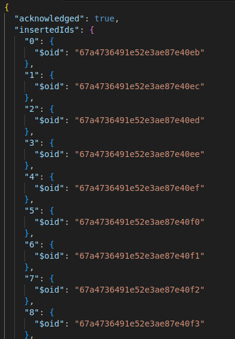

# MongoDB Assignment

### Task-1:   Insert 100 Records  

```
db.products.insertMany(
    [
        {
            "name": "Ginger",
            "price": 64,
            "available_quantity": 47,
            "shop": "Pure Produce"
        },
        {
            "name": "Blueberry",
            "price": 42,
            "available_quantity": 16,
            "shop": "Fruit Fiesta"
        },

                    .
                    .
                    .

        {
            "name": "Potato",
            "price": 30,
            "available_quantity": 29,
            "shop": "Farm Fresh Produce"
        },
        {
            "name": "Tomato",
            "price": 43,
            "available_quantity": 34,
            "shop": "Fruitful Finds"
        }
    ]
);
```

-   Output Screenshots:




```

db.products.find({})

```


### Task-2:  Update 100 records
-   Increase price by 5% : (price + price*(0.05))

```
db.products.updateMany({},
    {
        $mul:{"price": 1.05}
    }
)
```

-   Output Screenshots:


```

db.products.find({})

```


### Task-3:  Perform indexing on particular 3 fields in MongoDB

```
db.products.createIndex({name: 1, price: 1, shop: 1})
```

-   Output Screenshots:


-   Perform Search

```
db.products.find({
    name: "Apple",
    price: 81.9,
    shop: "Fresh Fields Market"
}).explain("executionStats")
```


### Task-4:  Find duplicates using aggrigates in MongoDB
-   Finding the duplicate documnets having same value for all of these fields: {name, price and shop}.

```
db.products.aggregate([
    {
        $group: {
          _id: {name:"$name", price:"$price", shop: "$shop"},
          count: {$sum: 1}
        }
    },
    {
        $match: {
          count : {$gt: 1}
        }
    },
]).toArray()
```

